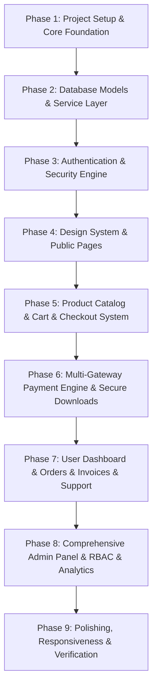

# YBT Digital – Modern Full-Stack Digital Product Platform Architecture

A clean, modern, and production-grade digital marketplace platform (YBT Digital) built with Next.js App Router, TypeScript, Tailwind CSS, and MongoDB.

---

## 1. Technical Stack Confirmations

- [x] **PHP completely removed**: No PHP files, runtimes, or scripts will be used.
- [x] **MySQL & XAMPP completely removed**: Replaced with modern cloud/local MongoDB & Node.js environment.
- [x] **Next.js App Router**: Latest Next.js App Router architecture with Server Components and Route Handlers / Server Actions.
- [x] **TypeScript**: End-to-end static typing with strict TypeScript configuration and Zod validation schemas.
- [x] **Node.js Server Architecture**: Clean service layer pattern (`services/*.service.ts`) decoupling database operations and business logic from UI.
- [x] **MongoDB & Mongoose**: Fully structured Mongoose schemas with indexes, validation, and relationships.
- [x] **Tailwind CSS & shadcn/ui**: Modern design system with dark/light mode via `next-themes` and Lucide icons.
- [x] **PDF Features Unchanged**: 100% of all user and admin functional requirements from the specification PDF are preserved and translated.

---

## 2. Updated Technology Stack

| Layer | Technology | Details |
|---|---|---|
| **Framework** | **Next.js (Latest) App Router** | Server Components by default, React 19, Client interactivity where needed |
| **Language** | **TypeScript** | Strict mode, zero unsafe `any`, typed API contracts |
| **Styling & UI** | **Tailwind CSS + shadcn/ui + Lucide Icons** | Design tokens, glassmorphism, responsive grid, native mobile app layout + desktop layout |
| **Theming** | **next-themes** | Persistent Dark Mode / Light Mode support across public, user, and admin interfaces |
| **Database & ODM** | **MongoDB & Mongoose** | Structured schemas, indexing, atomic updates, lifecycle hooks |
| **Authentication** | **Custom Secure JWT / Session Auth** | bcrypt hashing, HTTP-only secure cookies, RBAC (`SUPER_ADMIN`, `EDITOR`, `USER`) |
| **Payments** | **Multi-Gateway Engine** | Razorpay, Stripe, PayPal + Admin-switchable active gateway + Demo Test Mode |
| **Media Storage** | **Cloudinary Service** | Optimized image storage for product thumbnails, screenshots, logos, branding |
| **Secure Digital Files** | **Private Storage & Server-Auth Downloads** | Pre-signed/authorized streams, anti-leaking protection, optional expiry, access logs |
| **Validation & Security**| **Zod + Sanitization** | Server-side validation, IDOR prevention, query injection sanitization, rate limiting |

---

## 3. Detailed Project Architecture

```
ybt-digital/
├── app/
│   ├── layout.tsx                     # Root layout with ThemeProvider, AuthProvider, CartProvider, Toaster
│   ├── globals.css                    # Design tokens, custom scrollbars, animations
│   │
│   ├── (public)/                      # Public routes (SEO friendly, Server Components)
│   │   ├── page.tsx                   # Landing page (Hero, Featured, Testimonials, FAQ, CTA)
│   │   ├── products/                  # Product catalog with search, filters (category, price, popularity)
│   │   │   ├── page.tsx
│   │   │   └── [slug]/page.tsx        # Product detail with screenshots, demo, buy now / add to cart
│   │   ├── faq/page.tsx               # Dynamic FAQ loaded from database
│   │   └── contact/page.tsx           # Contact form with validation & ticket integration
│   │
│   ├── (auth)/                        # Authentication routes
│   │   ├── login/page.tsx             # User login
│   │   ├── signup/page.tsx            # User registration
│   │   ├── forgot-password/page.tsx   # Request password reset link/token
│   │   └── reset-password/page.tsx    # Password reset submission
│   │
│   ├── (user)/                        # Protected User Portal
│   │   ├── profile/page.tsx           # Edit name, email, change password
│   │   ├── cart/page.tsx              # Cart items, coupon discount code preview, totals
│   │   ├── checkout/page.tsx          # Multi-gateway selector (Razorpay, Stripe, PayPal, Demo), tax breakdown
│   │   ├── orders/page.tsx            # Order history, status, invoice view
│   │   ├── downloads/page.tsx         # Secure purchased digital downloads
│   │   └── support/page.tsx           # User support tickets / queries
│   │
│   ├── admin/                         # Protected Admin Panel (RBAC: Super Admin, Editor)
│   │   ├── login/page.tsx             # Dedicated secure admin login
│   │   ├── dashboard/page.tsx         # KPI overview, revenue metrics, recent orders
│   │   ├── products/                  # Product management (CRUD, active/inactive, digital file uploads)
│   │   ├── orders/                    # Order tracking, transaction IDs, manual/auto refunds
│   │   ├── users/                     # User management (block/unblock, purchase history)
│   │   ├── coupons/                   # Coupon manager (flat/percentage, limits, expiry)
│   │   ├── analytics/                 # Daily/monthly sales reports, top-selling products, tax reports
│   │   ├── support/                   # Ticket management, customer replies
│   │   ├── faq/                       # FAQ manager (create/edit/reorder)
│   │   └── settings/                  # Payment gateway keys, tax rates (GST/VAT), branding, email templates
│   │
│   └── api/                           # Secure REST & Download Endpoints
│       ├── auth/                      # Login, signup, logout, session verification
│       ├── products/                  # Public & admin product API
│       ├── cart/                      # Cart operations
│       ├── coupons/validate/          # Server-side coupon verification
│       ├── checkout/                  # Order initialization & signature verification
│       ├── payments/                  # Webhooks & payment gateway callbacks
│       ├── downloads/[token]/         # Authorized digital file streaming
│       ├── invoices/[orderId]/        # Dynamic PDF / HTML receipt generation
│       └── uploads/                   # Secure media upload handling
│
├── components/
│   ├── ui/                            # Buttons, inputs, dialogs, badges, dropdowns, tables, tabs
│   ├── layout/                        # Desktop Navbar, Mobile AppBar, Mobile Bottom Navigation, Footer
│   ├── products/                      # ProductCard, ProductGrid, ProductFilters, ScreenshotGallery
│   ├── cart/                          # CartDrawer, CartItem, CouponInput, PriceSummary
│   ├── checkout/                      # PaymentSelector, StripeForm, RazorpayButton, PayPalButton, DemoCheckout
│   ├── admin/                         # AdminSidebar, AdminHeader, StatsCard, DataTable, ChartWidget
│   └── user/                          # UserSidebar, OrderCard, DownloadItem, TicketThread
│
├── lib/
│   ├── db.ts                          # Cached Mongoose connection with connection pooling
│   ├── auth.ts                        # JWT / session token generation, hashing, verification
│   ├── cloudinary.ts                  # Cloudinary SDK wrapper
│   ├── storage.ts                     # Private storage abstraction (Local/S3/R2/Cloudinary)
│   ├── validations/                   # Zod schemas (auth, product, coupon, order, settings)
│   └── utils.ts                       # Formatters (currency, date), class merger (`cn`)
│
├── models/                            # Mongoose Schemas & Models
│   ├── User.ts                        # User accounts, status (active/blocked)
│   ├── Admin.ts                       # Admin accounts & roles (`SUPER_ADMIN`, `EDITOR`)
│   ├── Product.ts                     # Products, pricing, screenshots, category, digital file meta
│   ├── Category.ts                    # Product categories
│   ├── Cart.ts                        # User persistent cart
│   ├── Order.ts                       # Orders, items, totals, tax, discount, status
│   ├── Payment.ts                     # Gateway transaction IDs, raw responses, refund status
│   ├── Coupon.ts                      # Promo codes, discounts, usage counters, expiry
│   ├── Download.ts                    # Secure download tokens, download limits, expiry logs
│   ├── SupportTicket.ts               # Customer support tickets & threaded messages
│   ├── FAQ.ts                         # Dynamic FAQ items
│   ├── Setting.ts                     # Global configuration (gateways, taxes, branding)
│   └── PasswordReset.ts               # Reset tokens with expiration
│
├── services/                          # Dedicated Business Logic Services
│   ├── product.service.ts
│   ├── cart.service.ts
│   ├── coupon.service.ts
│   ├── checkout.service.ts
│   ├── order.service.ts
│   ├── payment.service.ts
│   ├── download.service.ts
│   ├── storage.service.ts
│   └── analytics.service.ts
│
├── types/                             # Global TypeScript declarations & interface definitions
├── middleware.ts                      # Route protection for user portal & admin RBAC
├── .env.example                       # Environment variable templates
├── package.json
├── tsconfig.json
└── next.config.ts
```

---

## 4. Database Schema Specifications

1. **User**: `name`, `email` (unique index), `password` (bcrypt hash), `role` (`user`), `isBlocked`, `createdAt`, `updatedAt`
2. **Admin**: `name`, `email` (unique index), `password` (bcrypt hash), `role` (`SUPER_ADMIN` | `EDITOR`), `isActive`, timestamps
3. **Category**: `name`, `slug` (unique index), `description`, `icon`, `isActive`, timestamps
4. **Product**: `title`, `slug` (unique index), `description`, `shortDescription`, `price`, `salePrice`, `category` (ref), `tags`, `thumbnailUrl`, `screenshots` (array), `demoUrl`, `fileKey`, `fileName`, `fileSize`, `status` (`active` | `inactive`), `salesCount`, `rating`, timestamps
5. **Cart**: `user` (ref), `items`: `[{ product, price, quantity }]`, timestamps
6. **Order**: `orderNumber` (unique index), `user` (ref), `items`: `[{ product, title, price, fileKey }]`, `subtotal`, `taxAmount`, `taxRate`, `discountAmount`, `couponCode`, `totalAmount`, `paymentGateway` (`razorpay` | `stripe` | `paypal` | `demo`), `paymentStatus` (`pending` | `paid` | `failed` | `refunded`), `transactionId`, `invoiceNumber`, timestamps
7. **Payment**: `orderId` (ref), `gateway`, `transactionId` (index), `amount`, `currency`, `status`, `rawResponse`, `refundDetails`, timestamps
8. **Coupon**: `code` (uppercase unique index), `discountType` (`percentage` | `flat`), `discountValue`, `minOrderAmount`, `maxDiscountAmount`, `maxUsage`, `usedCount`, `expiresAt`, `isActive`, timestamps
9. **Download**: `orderId` (ref), `userId` (ref), `productId` (ref), `token` (unique index), `downloadCount`, `maxDownloads`, `expiresAt`, timestamps
10. **SupportTicket**: `ticketNumber` (unique index), `user` (ref), `subject`, `category`, `status` (`open` | `in_progress` | `resolved` | `closed`), `priority`, `messages`: `[{ sender, senderRole, message, attachments, createdAt }]`, timestamps
11. **FAQ**: `question`, `answer`, `category`, `order`, `isPublished`, timestamps
12. **Setting**: `key` (unique index), `value` (JSON schema for payment gateways, taxes, branding, email config), timestamps
13. **PasswordReset**: `userId` (ref), `token` (hashed index), `expiresAt`, `used`, timestamps

---

## 5. Development Phases



### Phase 1: Project Setup & Core Foundation
- Initialize Next.js project with App Router, TypeScript, and Tailwind CSS.
- Configure `next-themes`, Lucide icons, shadcn component utilities (`cn`), and strict TypeScript configurations.
- Setup `.env.example` with environment variables for MongoDB, JWT secrets, Cloudinary, Razorpay, Stripe, PayPal, and Demo mode.

### Phase 2: Database Layer & Services Foundation
- Setup cached MongoDB Mongoose connection (`lib/db.ts`) with robust connection error handling and pooling.
- Build all 13 Mongoose models with strict typing, indexes, and validation rules.
- Create base service abstraction for storage and initial seed scripts for categories, demo products, admin accounts, and settings.

### Phase 3: Authentication & Authorization (RBAC)
- Implement password hashing with `bcrypt` and JWT / secure HTTP-only cookie sessions.
- Build user signup, login, password reset flow.
- Build dedicated admin login with RBAC enforcement (`SUPER_ADMIN` vs `EDITOR`) in Next.js middleware and API route guards.

### Phase 4: Modern Design System & Public Storefront
- Implement desktop Navbar with dynamic search, user profile menu, cart badge, and theme switcher.
- Implement native mobile AppBar and 4-tab Bottom Navigation (Home, Products, Cart, Profile).
- Build Landing Page with Hero section + CTA, Featured Products showcase, dynamic FAQ accordion, Testimonials, and modern footer.
- Build dynamic Product Listing with responsive grid/list, multi-criteria filtering (category, price range, popularity), and instant search.
- Build Product Detail Page with screenshot gallery, interactive demo links, pricing, features list, and direct "Add to Cart" / "Buy Now".

### Phase 5: Cart, Coupon & Checkout Architecture
- Build persistent Cart system with real-time total, tax, and discount computations.
- Build Coupon validation service with strict server-side rules (expiration, usage limits, minimum order).
- Build Checkout experience with billing information, order summary, and dynamic payment gateway selector.

### Phase 6: Multi-Gateway Payment System & Secure Digital Downloads
- Implement payment integration layer supporting Razorpay, Stripe, PayPal, and interactive Demo Payment Mode.
- Build Webhook handlers and server-side signature verification to prevent spoofing.
- Implement secure digital download token generator with server-authorized streaming route (`/api/downloads/[token]`).
- Implement dynamic HTML/PDF Invoice generator (`/api/invoices/[orderId]`).

### Phase 7: User Dashboard, Orders & Support
- Build User Profile management (name, email, password update).
- Build Orders history page with transaction status, invoice download, and direct download links.
- Build User Downloads library with expiry indicators and re-download capability.
- Build Support ticket creation and real-time conversation thread UI.

### Phase 8: Comprehensive Admin Panel
- **Admin Dashboard**: Real-time sales metrics, revenue overview, top selling products, recent orders table.
- **Product Management**: Add/Edit/Delete products, Cloudinary image uploader, secure file uploader, category picker, active/inactive status toggle.
- **Order & Refund Management**: Filter orders, view transaction logs, trigger refunds.
- **User Management**: View registered users, view user purchase history, block/unblock users.
- **Coupon Manager**: Create percentage/flat discount codes, set usage limits, set expiration dates.
- **Analytics & Reports**: Daily/monthly revenue breakdown, tax collection summaries (GST/VAT).
- **Support & FAQ Manager**: Reply to user queries, update ticket status, manage public FAQ items.
- **Settings Manager**: Configure active payment gateways & API keys, adjust GST/VAT tax rates, modify website branding (logo, title, footer text), configure email notifications.

### Phase 9: Verification, UI Polish & Native Mobile Optimization
- Verify dark/light mode across all routes, cards, modals, and tables.
- Validate desktop (1080p/4K), tablet, and mobile views (simulating native app experience).
- Perform end-to-end user checkout flow from landing page to digital file download.
- Verify admin permissions and role isolation.
